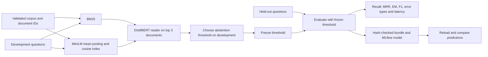

# Retrieval QA Evaluation

Compare BM25 and dense retrieval, inspect reader failures, calibrate when to abstain, and reload the complete QA pipeline from MLflow. Everything runs locally on CPU.

The project includes an original synthetic knowledge base, disjoint development and held-out question sets, a real MiniLM encoder, a DistilBERT extractive reader, and a separate Haystack 1.x experiment. Each prediction retains retrieved document IDs, answer offsets, confidence, error attribution, and phase latency.

## Run

Requires macOS ARM64 or Linux, internet access for initial package/model downloads, and about 4 GB of free disk space. Python 3.13 can bootstrap the isolated Python 3.11 runtime.

```bash
./scripts/bootstrap.sh
.venv/bin/retrieval-eval audit
.venv/bin/retrieval-eval download
TOKENIZERS_PARALLELISM=false .venv/bin/retrieval-eval run \
  --output artifacts/my-run --evidence evidence/my-benchmark.json
.venv/bin/retrieval-eval predict --bundle artifacts/my-run/bundle \
  'How long are visitor logs preserved in the Iris archive?'
```

Choose a new output directory for each run; existing runs are protected from overwriting. The model download is approximately 365 MB and fetches two fixed revisions. Prediction and model reload use local files.

```bash
.venv/bin/pytest -m 'not integration' -q
RUN_MODEL_TESTS=1 TOKENIZERS_PARALLELISM=false .venv/bin/pytest -q
.venv/bin/ruff check src tests experiments/haystack1
```

The [runbook](docs/runbook.md) covers MLflow, offline execution, the isolated Haystack experiment, and troubleshooting.

## Evaluation flow



The original corpus has 24 documents and 24 questions: 12 development and 12 held-out. Each split has eight answerable and four unanswerable questions. Gold document IDs are disjoint across splits, while both retrievers search the same unlabeled corpus. Distractors deliberately share terms and business rules with relevant documents. See [data provenance](data/provenance.json).

## Measured results

The saved [benchmark](evidence/benchmark.json) ran using an Apple M3 Pro, 18 GiB memory, two Torch CPU threads, and no GPU. Latencies are a single warm sequential pass over 12 held-out queries; download, startup, index build, and warmup are excluded. The host also ran other development processes, so these figures are descriptive rather than capacity estimates.

| Held-out metric | BM25 + reader | Dense + reader |
|---|---:|---:|
| Recall@1 / Recall@3 / Recall@5 | 1.000 / 1.000 / 1.000 | 1.000 / 1.000 / 1.000 |
| MRR@5 | 1.000 | 1.000 |
| Answer exact match | 0.500 | 0.250 |
| Answer token F1 | 0.601 | 0.351 |
| Answer coverage | 0.750 | 0.917 |
| Total latency p50 / p95 | 50.0 / 55.3 ms | 74.3 / 98.6 ms |
| Reader failures | 5 | 6 |
| Unanswerable false positives | 1 | 3 |

The correct document was retrieved for every answerable question, yet the reader often selected an overlong span or a confident answer from another retrieved document. Dense retrieval did not improve answer quality on this dataset. This small synthetic split supports debugging and reproducibility; it does not establish general model superiority.

Abstention thresholds maximize balanced answerability accuracy on development questions, with the more conservative threshold breaking ties. Reader confidence is a span score, not an answerability probability. The threshold is frozen before held-out inference. [Evaluation details](docs/evaluation.md) explain denominators and error categories.

MLflow logged both retrievers' metrics, benchmark artifacts, and the dense pipeline. The main test suite passed 22 tests; the separate Haystack integration also passed. Loading the logged `pyfunc` model produced exactly identical answers, confidence values, abstention decisions, document IDs, and offsets for all 12 held-out questions. The bundle contains model files and the index; SHA-256 checks reject mismatched corpus, document order, model files, and embedding bytes.

## Components and versions

| Component | Main environment | Separate Haystack environment |
|---|---|---|
| Python | 3.11.14 | 3.11.14 |
| PyTorch | 2.5.1 | 2.5.1 |
| Transformers | 4.44.2 | 4.39.3 |
| MLflow | 2.17.2 | Not installed |
| Haystack | Not installed | farm-haystack 1.26.3 |
| Sentence Transformers | Explicit Transformer + mean pooling | 2.7.0 |

The [compatibility ADR](docs/adr/001-environments.md) explains why the environments are separate. The [Haystack report](evidence/haystack1.json) contains an executed BM25/dense comparison using the same model files and corpus. Haystack's reader receives title plus text; the main reader receives text only, so the reports are separate experiments.

## Project map

- `src/retrieval_lab/core.py`: validation, BM25, metrics, and threshold selection.
- `src/retrieval_lab/models.py`: real dense inference, extractive reading, bundle persistence.
- `src/retrieval_lab/tracking.py`: MLflow model packaging and reload verification.
- `src/retrieval_lab/benchmark.py`: audit, download, run, and predict commands.
- `experiments/haystack1/`: pinned legacy API adapter and executable integration check.
- `tests/`: malformed input, empty retrieval, duplicate IDs, split leakage, index mismatch, real semantic retrieval, reload, and JSON-null regression checks.

The [hosted Ubuntu CI run](https://github.com/abhisheksaini333/retrieval-qa-evaluation-retrospective/actions/runs/36570175393) passed at commit `74bbd4b`: locked environment setup, lint, 17 lightweight tests and dataset validation. Five model integration tests are excluded from this default job. Real-model CI is an explicit manual workflow with a timeout and a fixed two-model download; the model and Haystack results above come from local execution.

## Attribution

The corpus, evaluation harness, failure taxonomy, threshold policy, persistence checks, and integration adapters were written for this project. The pretrained models and libraries retain their own licenses. Source code and synthetic data are [MIT licensed](LICENSE); model weights are downloaded separately and are not committed. [Sources](docs/sources.md) links the retrieval methods, model cards, library APIs, and archived model documentation.

See [extended evaluation workflows](docs/extended-evaluation.md) for configurable experiments, bundle inspection/archives, paired comparison, and batch prediction.
